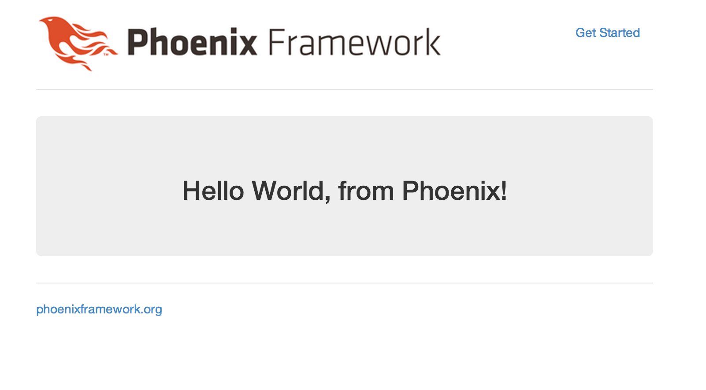

# Adding Pages

Phoenixプロジェクトに２つの新しいページを追加してみましょう。１つ目は単純な静的ページを追加します。２つ目はURLから値を取得して動的なページを追加します。途中で、Phoenixプロジェクトにおける基本的なコンポーネントに詳しくなれるでしょう。基本的なコンポーネントとは、Router、Controller、View、Templateを指します。

Phoenixプロジェクトを新規作成すると、ディレクトリ構造は以下のようになっています。

```console
├── _build
├── assets
├── config
├── deps
├── lib
│   └── hello
│   └── hello_web
│   └── hello.ex
│   └── hello_web.ex
├── priv
├── test
```

このガイドでは、主に `lib/hello_web` ディレクトリに変更を加えていきます。このディレクトリはアプリケーションのwebに関する機能を担っています。`lib/hello_web` を展開すると以下のようになっています。

```console
├── channels
│   └── user_socket.ex
├── controllers
│   └── page_controller.ex
├── templates
│   ├── layout
│   │   └── app.html.eex
│   └── page
│       └── index.html.eex
└── views
│   ├── error_helpers.ex
│   ├── error_view.ex
│   ├── layout_view.ex
│   └── page_view.ex
├── endpoint.ex
├── gettext.ex
├── router.ex
```

`controllers`、`templates`および`views`ディレクトリには、前のガイドでみた"Welcome to Phoenix!"ページをつくるためのファイルがあります。そのコードの一部をすぐに再利用する方法を確認します。developmentモードでは、コードの変更は自動的にコンパイルされて反映されます。

`assets`ディレクトリには、アプリケーション全体で使うjs、css、画像ファイルがあり、webpackもしくは他のフロントエンドツールでビルドされます。このガイドではこれらに変更を加えることはしませんが、あとにでてくる参照先を探すことは良いことです。

またwebとは関係しないファイルがあることも知っておくべきです。applicationファイル（Elixirアプリケーションとsupervision treeを開始するファイル）は、`lib/hello/application.ex`にあります。またデータベースを操作するEcto Repoも、`lib/hello/repo.ex` にあります。[guide for Ecto](ecto.html)でより詳しく説明します。

```console
lib
├── hello
|   ├── application.ex
|   └── repo.ex
├── hello_web
|   ├── channels
|   ├── controllers
|   ├── templates
|   ├── views
|   ├── endpoint.ex
|   ├── gettext.ex
|   └── router.ex
```

`lib/hello_web`にはルーター、コントローラー、テンプレート、チャネルなど、web機能に関連するファイルがあります。生成された他のファイルは`lib/hello`にあり、他のElixirアプリケーションのようにここにコードを構築します。

準備が整ったら、Phoenixの最初の新しいページを追加してみましょう！

### 新しいRoute

Routeは一意なHTTP verb/pathのペアをそれらを処理するcontroller/actionのペアを紐付けます。Phoenixはこの紐付けを行うファイルとして`lib/hello_web/router.ex`を生成します。このセクションではこのファイルを変更していきます。

前回のUp And Running Guideで表示した"Welcome to Phoenix!"ページのためのルートは以下の部分が該当します。

```elixir
get "/", PageController, :index
```

このRouteの意味を説明します。[http://localhost:4000/](http://localhost:4000/) にアクセスをすると、ルートパスへのHTTP `GET`が発行されます。このリクエストは、`lib/hello_web/controllers/page_controller.ex`に定義された`HelloWeb.PageController`モジュールの`index`関数によって処理されます。

[http://localhost:4000/hello](http://localhost:4000/hello)にブラウザでアクセスしたら、"Hello World, from Phoenix!"を表示するようにして行きましょう。

最初にやるべきことはRouteの追加です。`lib/hello_web/router.ex`をテキストエディタで開いてみましょう。以下のようになっていることでしょう。

```elixir
defmodule HelloWeb.Router do
  use HelloWeb, :router

  pipeline :browser do
    plug :accepts, ["html"]
    plug :fetch_session
    plug :fetch_flash
    plug :protect_from_forgery
    plug :put_secure_browser_headers
  end

  pipeline :api do
    plug :accepts, ["json"]
  end

  scope "/", HelloWeb do
    pipe_through :browser

    get "/", PageController, :index
  end

  # Other scopes may use custom stacks.
  # scope "/api", HelloWeb do
  #   pipe_through :api
  # end
end

```

いまは、pipelineは置いておいて、ここでは`scope`を使ってルートを追加することにしましょう。(興味があるなら、[Routing Guide](routing.html)をご参照ください。)

新しいルートを追加しましょう。`GET /hello`を後ほどすぐにつくる`HelloWeb.HelloController`モジュールの`index`関数に紐付けるように以下を追加します。:

```elixir
get "/hello", HelloController, :index
```

`router.ex`内の`scope "/"`をこのように変更します:

```elixir
scope "/", HelloWeb do
  pipe_through :browser

  get "/", PageController, :index
  get "/hello", HelloController, :index
end
```

### 新しいコントローラー

コントローラーはElixirのモジュールです。アクションはElixirの関数です。アクションは、レンダリングのためにデータを集めて必要なタスクを実行します。`index/2`アクションを持つ`HelloWeb.HelloController`モジュールをRouteで指定しています。

そのため、`lib/hello_web/controllers/hello_controller.ex`を以下のように作成してみましょう。

```elixir
defmodule HelloWeb.HelloController do
  use HelloWeb, :controller

  def index(conn, _params) do
    render(conn, "index.html")
  end
end
```
`use HelloWeb, :controller`については、[Controllers Guide](controllers.html)に譲ることにします。いまは、`index/2`アクションに着目します。

すべてのコントローラーアクションは２つの引数を取ります。第一引数は`conn`で、これはリクエストについての
リクエストに関する大量のデータを保持する構造体です。第二引数は`params`でリクエストパラメータです。ここでは未使用のため、コンパイラの警告を避けるため、`_params`としています。

このアクションのポイントは`render(conn, "index.html")`です。これはPhoenixに`index.html.eex`というテンプレートをみつけてレンダーするように指示しています。Phoenixはコントローラー名にちなんだtemplateディレクトリを探します。今回の場合は、`lib/hello_web/templates/hello`となります。

> Note: テンプレート名としてatomを使うこともできます。ここでは`render(conn, :index)`となりますが、テンプレートはAcceptヘッダーに基づいて選択されます。つまり、`"index.html"` もしくは `"index.json"`となります。

レンダリングの責務をもつモジュールはViewです。つづいて新しいViewを作ってみましょう。

### 新しいView

PhoenixのViewはいくつかの重要な処理を行います。Viewは、Templateのレンダリングを行います。ViewはControllerがTemplateで使うように準備した生データのためのプレゼンテーション層として働きます。この変換を実行する関数がViewの中にあります。

たとえば、`first_name`フィールドと`last_name`フィールドをもつuser構造体があるとして、userのフルネームをTemplateで表示したいとします。２つのフィールドを連結してフルネームを得るようにテンプレートにコードを書くこともできますが、よりよい方法はViewに関数を作って、Templateではその関数を呼び出すことです。その結果、簡潔で可読性の高いTemplateとなります。

`HelloController`のためにTemplateをレンダリングするためには、`HelloView`が必要となります。名前には重要な意味があります。View名とController名の最初の部分は一致している必要があります。Viewの詳細はあとで説明をします。`lib/hello_web/views/hello_view.ex`を作成し、中身を以下のようにします:

```elixir
defmodule HelloWeb.HelloView do
  use HelloWeb, :view
end
```

### 新しいTemplate

PhoenixのTemplateはデータをレンダーします。PhoenixのデフォルトのテンプレートエンジンはElixirに標準として組み込まれている`EEx`です。Phoenixは自動的にデータをエスケープするようにEExを拡張しています。これはCross-Site-Scriptingのような脆弱性を追加作業なしに防ぎます。Templateファイルの拡張子は`.eex`です。

TemplateのスコープはViewに限定され、ViewはControllerに限定されます。Phoenixは`lib/hello_web/templates`ディレクトリを作ります。View名とController名の最初の部分は一致している必要があったように、Templateにも格納場所には意味があります。helloページのためには、`lib/hello_web/templates`の下に`hello`ディレクトリを作り、そのなかに`index.html.eex`ファイルを作ります。

それでは、`lib/hello_web/templates/hello/index.html.eex`を作って、以下のようにに中身を書いてみましょう:

```html
<div class="phx-hero">
  <h2>Hello World, from Phoenix!</h2>
</div>
```

いま、Route、Controller、View、Templateを作りましたので、ブラウザで[http://localhost:4000/hello](http://localhost:4000/hello)にアクセスをすると、Phoenixからあいさつが表示されるでしょう。(表示されない場合には、一度サーバを止めて、再起動のために`mix phx.server`を行ってください)



ここまでおこなったことに興味深いことがいくつかあったことにお気づきのことでしょう。これらの変更を行う間、サーバーを止めたり再起動する必要はなかった。その通りです！ Phoenixはホットコードリローディングをしてくれます。また`index.html.eex`が`div`タグだけで構成されるようにすると、ページは全部のHTMLを得ます。indexテンプレートは、アプリケーションレイアウトでレンダリングされています。アプリケーションレイアウトは`lib/hello_web/templates/layout/app.html.eex`にあります。これを開くと、以下のような行が含まれています:

```html
<%= render @view_module, @view_template, assigns %>
```

このコードは、HTMLをブラウザへ返す前にレイアウトの中にテンプレートをレンダーしています。

ホットコードリローディングについての補足をしておきます。自動リンターを備えたいくつかのエディタはホットコードリローディングが動作するのを妨げる場合があります。もしホットコードリローディングが動作しない場合には、[このissue](https://github.com/phoenixframework/phoenix/issues/1165)の議論をご参照ください。

## ２つめの新しいページ

アプリケーションに少し複雑な変更を加えてみましょう。URLの一部を認識する新しいページを使いしてみましょう。"messenger"というラベルを付け、Controllerを介してTemplateに渡し、messengerがあいさつするようにします。

前回同様、まずは新しいルートを作りましょう。

### 新しいRoute

`HelloController`を使い、新しいアクション`show`を追加します。`lib/hello_web/router.ex`を以下のように変更をします。

```elixir
scope "/", HelloWeb do
  pipe_through :browser

  get "/", PageController, :index
  get "/hello", HelloController, :index
  get "/hello/:messenger", HelloController, :show
end
```
パスには`:messenger`というatomを指定していることに注目してください。PhoenixはURLのこの位置に存在するどんな値でも`messenger` keyと値のセットをもった`Map`をControllerへ渡します。

たとえば、ブラウザで[http://localhost:4000/hello/Frank](http://localhost:4000/hello/Frank)にアクセスすると、`%{"messenger" => "Frank"}`がControllerに渡されます。

### 新しいアクション

さきほど追加したルートへのリクエストは`HelloWeb.HelloController`の`show`アクションで処理されます。すでに`lib/hello_web/controllers/hello_controller.ex`はあるので、そのなかに`show`アクションを追加しましょう。今回は、アクションに渡されるparamsのMap内のアイテムの１つを保持して、Templateへmessengerとして渡す必要があります。このため、Controllerにshow関数を追加しましょう:

```elixir
def show(conn, %{"messenger" => messenger}) do
  render(conn, "show.html", messenger: messenger)
end
```

ここでいくつかのことに気づかれるでしょう。URLの`:messenger`の位置にある値を`messenger`変数として束縛するように、show関数へ渡されたparamsにパターンマッチを使います。たとえば、URLが[http://localhost:4000/hello/Frank](http://localhost:4000/hello/Frank)だとすると、messenger変数は`Frank`に束縛されます。

`show` action内のrender関数では第三引数を渡しています。keyが`:messenger`で値は`messenger`変数です。

> Note: アクション内でMapパラメータ全体へのアクセスが必要なのであれば、messenger変数へ束縛することに加えて、params変数にも束縛するように、`show/2`のように以下のように定義します。

```elixir
def show(conn, %{"messenger" => messenger} = params) do
  ...
end
```

`params` mapのキーはいつも文字列であり、= は割り当てを表すのではなく、[pattern match](https://elixir-lang.org/getting-started/pattern-matching.html)表明であることを覚えておくのは良いことです。

### 新しいTemplate

このパズルの最後のピースは、新しいTemplateです。`HelloController.show`に対応するように`lib/hello_web/templates/hello`ディレクトリ内に`show.html.eex`を配置しましょう。messengerの名前を表示する必要があることを除いて、それは驚くべきことに `index.html.eex`テンプレートに似ています。

名前を表示するため、特別なEEx tagsを使います。それはつまり`<%=  %>`です。最初のタグには次のような等号があることに注意してください: `<％=`。つまり、これらのタグの間にあるElixirコードが実行され、結果の値がタグに置き換わります。等号が無い場合には、コードは実行されますが、値はページに表示されません。


`lib/hello_web/templates/hello/show.html.eex`は以下のようになります:

```html
<div class="phx-hero">
  <h2>Hello World, from <%= @messenger %>!</h2>
</div>
```

messengerは`@messenger`に格納されています。ここでは、モジュールの属性ではありません。これは、`assigns.messenger`を表すメタプログラムされた特別な構文です。その結果、見た目がよくなり、Templateの作成がはるかに簡単になりました。

完了です。ブラウザで[http://localhost:4000/hello/Frank](http://localhost:4000/hello/Frank)にアクセスしてみると、このように表示されることでしょう:


少し遊んでみましょう。/hello/に続く文字は、messengerとしてページに表示されることでしょう。
