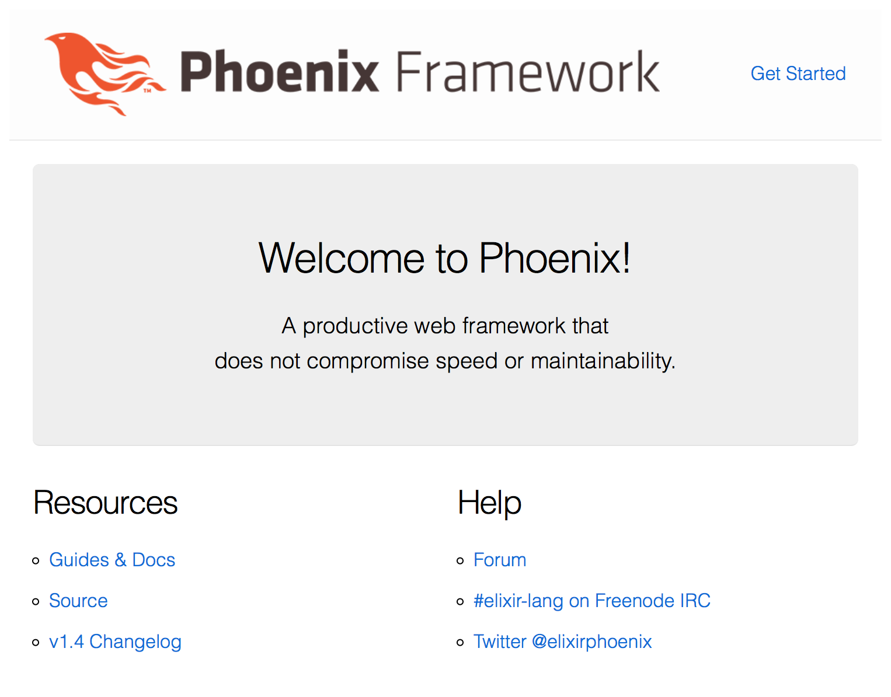

# 起動

この最初のガイドの目的は、Phoenixアプリケーションをできるだけ早く起動して実行することです。

始める前に、[インストールガイド](./introduction/installation.html)を読んでください。必要な依存関係を事前にインストールすることにより、アプリケーションをスムーズに起動して実行できるようになります。

この時点で、Elixir、Erlang、Hex、およびPhoenixアーカイブをインストールする必要があります。また、デフォルトのアプリケーションを構築するために、PostgreSQLとnode.jsをインストールする必要があります。

OK、準備完了です！

Phoenixアプリケーションを作成するために、任意のディレクトリから `mix phx.new` を実行できます。 Phoenixは、新しいプロジェクトのディレクトリの絶対パスまたは相対パスを受け入れます。アプリケーションの名前が`hello`であると仮定して、次のコマンドを実行しましょう。

```console
$ mix phx.new hello
```
> [webpack](https://webpack.js.org/)に関する注意：Phoenixはデフォルトでアセット管理にwebpackを使用します。 webpackの依存関係は、mixではなく、ノードパッケージマネージャーを介してインストールされます。 Phoenixは、`mix phx.new` タスクの最後にそれらをインストールするように促します。その時点で「いいえ」と言い、それらの依存関係を後で `npm install` でインストールしないと、アプリケーションは起動しようとするとエラーが発生し、アセットが適切にロードされない可能性があります。 webpackをまったく使いたくない場合は、単に `--no-webpack` を `mix phx.new` に渡すことができます。

> [Ecto](./ecto.html)に関する注意：Ectoにより、PhoenixアプリケーションはPostgreSQL、MySQLなどのデータストアと通信できます。アプリケーションがこのコンポーネントを必要としない場合、 `--no-ecto`フラグを `mix phx.new` に渡すことでこの依存関係をスキップできます。このフラグを `--no-webpack`と組み合わせて、スケルトンアプリケーションを作成することもできます。

> `mix phx.new` の詳細については、[Mix Tasks Guide](phoenix_mix_tasks.html#phoenix-specific-mix-tasks)を参照してください。

```console
mix phx.new hello
* creating hello/config/config.exs
* creating hello/config/dev.exs
* creating hello/config/prod.exs
...
* creating hello/assets/static/images/phoenix.png
* creating hello/assets/static/favicon.ico

Fetch and install dependencies? [Yn]
```
Phoenixは、アプリケーションに必要なディレクトリ構造とすべてのファイルを生成します。

> Phoenixは、バージョン管理ソフトウェアとしてgitの使用を促進しています。生成されたファイルの中に、 `.gitignore`があります。リポジトリを `git init` し、無視する対象ではないすべてのファイルをすぐに追加してコミットできます。

完了すると、依存関係をインストールするかどうかを尋ねられます。イエスと言ってみましょう。


```console
Fetch and install dependencies? [Yn] Y
* running mix deps.get
* running mix deps.compile
* running cd assets && npm install && node node_modules/webpack/bin/webpack.js --mode development

We are almost there! The following steps are missing:

    $ cd hello

Then configure your database in config/dev.exs and run:

    $ mix ecto.create

Start your Phoenix app with:

    $ mix phx.server

You can also run your app inside IEx (Interactive Elixir) as:

    $ iex -S mix phx.server
```

依存関係がインストールされると、タスクはプロジェクトディレクトリに移動してアプリケーションを起動するように促します。

Phoenixは、PostgreSQLデータベースに正しい権限と`postgres`のパスワードを持つ`postgres`ユーザーアカウントがあると想定しています。そうでない場合は、[Mixタスクガイド](phoenix_mix_tasks.html#ecto-specific-mix-tasks)を参照して、`mix ecto.create` タスクの詳細をご覧ください。

では、試してみましょう。最初に、作成したばかりの `hello/`ディレクトリに `cd`します。

```console
$ cd hello
```

次に、データベースを作成します。

```console
$ mix ecto.create
Compiling 13 files (.ex)
Generated hello app
The database for Hello.Repo has been created
```

>注意：このコマンドを初めて実行する場合、PhoenixはRebarのインストールを要求する場合があります。 ErlangパッケージのビルドにはRebarが使用されるため、インストールを進めてください。

最後に、Phoenixサーバーを起動します。

```console
$ mix phx.server
[info] Running HelloWeb.Endpoint with cowboy 2.5.0 at http://localhost:4000

Webpack is watching the files…
...
```

新しいアプリケーションを生成するときにPhoenixに依存関係をインストールさせないことを選択した場合、 `mix phx.new`タスクはそれらをインストールするときに必要な手順を実行するように促します。


```console
Fetch and install dependencies? [Yn] n

We are almost there! The following steps are missing:

    $ cd hello
    $ mix deps.get
    $ cd assets && npm install && node node_modules/webpack/bin/webpack.js --mode development

Then configure your database in config/dev.exs and run:

    $ mix ecto.create

Start your Phoenix app with:

    $ mix phx.server

You can also run your app inside IEx (Interactive Elixir) as:

    $ iex -S mix phx.server
```


デフォルトでは、Phoenixはポート4000でリクエストを受け入れます。お気に入りのWebブラウザを[http://localhost:4000](http://localhost:4000)に向けると、Phoenix Frameworkのウェルカムページが表示されます。



画面が上の画像のように見える場合、おめでとうございます！これで、Phoenixアプリケーションが動作するようになりました。上記のページが表示されない場合は、[http://127.0.0.1:4000](http://127.0.0.1:4000)からアクセスしてみて、OSが `localhost` を `127.0.0.1` と定義していることを確認してください。

ローカルでは、アプリケーションは `iex` セッションで実行されています。それを止めるには、 `iex`を普通に止めるのと同じように、`ctrl-c`を2回押します。

[次のステップ](./adding_pages.html)では、アプリケーションを少しカスタマイズして、Phoenixアプリがどのように組み立てられているかを把握しています。

