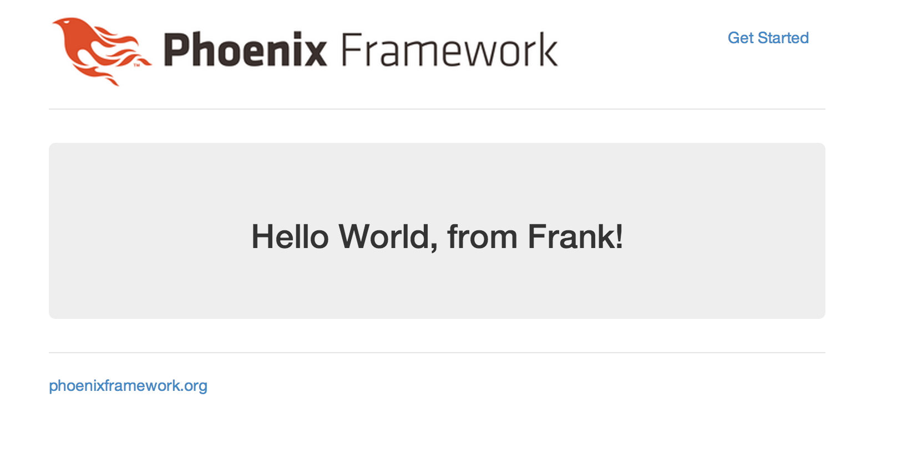

# リクエストライフサイクル

> **前提**: このガイドでは、入門ガイドの内容を理解し、Phoenixアプリケーションを実行していることを前提としています

このガイドの目的は、Phoenixのリクエストのライフサイクルについて話すことです。このガイドでは、Phoenixプロジェクトに2つの新しいページを追加し、その過程でどのようにしてピースが組み合わされていくのかをコメントするという、実践的なアプローチで学びます。

それでは、最初の新しいPhoenixのページから始めていきましょう！

## 新しいページを追加する

ブラウザが [http://localhost:4000/](http://localhost:4000/) にアクセスすると、そのアドレス上で動作しているサービス、この場合は私たちのPhoenixアプリケーションにHTTPリクエストを送信します。HTTPリクエストは動詞とパスで構成されています。たとえば、以下のブラウザのリクエストは次のように変換されます。

| ブラウザのアドレスバー                | 動詞 | パス          |
|:-----------------------------------|:-----|:--------------|
| http://localhost:4000/             | GET  | /             |
| http://localhost:4000/hello        | GET  | /hello        |
| http://localhost:4000/hello/world  | GET  | /hello/world  |

他にもHTTP動詞があります。たとえば、フォームを送信する際には通常POST動詞を使用します。

Webアプリケーションは通常、各動詞/パスのペアをアプリケーションの特定の部分にマッピングすることでリクエストを処理します。Phoenixのこのマッチングはルーターによって行われます。たとえば、"/articles" をすべての記事を表示するアプリケーションの一部にマッピングすることができます。したがって、新しいページを追加するために、最初のタスクは新しいルートを追加することです。

### 新しいルート

ルーターは、固有のHTTP動詞/パスのペアを、それらを処理するコントローラー/アクションのペアにマッピングします。Phoenixのコントローラーは単純にElixirモジュールです。アクションは、これらのコントローラー内で定義された関数です。

Phoenixは新しいアプリケーションでは、`lib/hello_web/router.ex`にルーターファイルを生成してくれます。このセクションではここで作業を行います。

前回の起動ガイドの"Welcome to Phoenix!"のページのルートはこんな感じです。

```elixir
get "/", PageController, :index
```

このルートが伝えていることを順に理解していきましょう。[http://localhost:4000/](http://localhost:4000/)にアクセスすると、ルートパスへのHTTP `GET` リクエストが発行されます。このようなリクエストはすべて、`lib/hello_web/controllers/page_controller.ex` で定義されている `HelloWeb.PageController` モジュールの `index` 関数で処理されます。

これから作成するページは、ブラウザを [http://localhost:4000/hello](http://localhost:4000/hello) に向けると、"Hello World, from Phoenix!" を返します。

そのページを作成するために、最初にそのページのルートを定義する必要があります。テキストエディターで `lib/hello_web/router.ex` を開いてみましょう。新しいアプリケーションの場合、次のようになります。

```elixir
defmodule HelloWeb.Router do
  use HelloWeb, :router

  pipeline :browser do
    plug :accepts, ["html"]
    plug :fetch_session
    plug :fetch_flash
    plug :protect_from_forgery
    plug :put_secure_browser_headers
  end

  pipeline :api do
    plug :accepts, ["json"]
  end

  scope "/", HelloWeb do
    pipe_through :browser

    get "/", PageController, :index
  end

  # Other scopes may use custom stacks.
  # scope "/api", HelloWeb do
  #   pipe_through :api
  # end
end

```

今のところ、ここではパイプラインと `scope` の使用は無視して、ルートを追加することに焦点を当てることにします。これらについては [ルーティングガイド](routing.html) で説明します。

`/hello` への `GET` リクエストを、ルーターの `scope "/" do` ブロック内にあり、じきに作成する `HelloWeb.HelloController` の `index` アクションにマップする新しいルートをルーターに追加してみましょう。

```elixir
scope "/", HelloWeb do
  pipe_through :browser

  get "/", PageController, :index
  get "/hello", HelloController, :index
end
```

### 新しいコントローラー

コントローラーはElixirのモジュールで、アクションはその中で定義されたElixirの関数です。アクションの目的は、データを収集し、レンダリングに必要なタスクを実行することです。設定したルートでは、`index/2` アクションを持つ `HelloWeb.HelloController` モジュールが必要だと指定しています。

これを実現するために、`lib/hello_web/controllers/hello_controller.ex`というファイルを新規に作成して、次のようにしてみましょう。

```elixir
defmodule HelloWeb.HelloController do
  use HelloWeb, :controller

  def index(conn, _params) do
    render(conn, "index.html")
  end
end
```

`use HelloWeb, :controller`についての議論は、[コントローラーガイド](controllers.html)のために取っておくことにします。とりあえず、`index/2`のアクションに注目してみましょう。

すべてのコントローラーのアクションは2つの引数をとります。1つ目は `conn` で、リクエストに関する大量のデータを保持する構造体です。2つ目は `params` で、これはリクエストのパラメーターです。ここでは `params` を使用しておらず、先頭の `_` を追加することでコンパイラの警告を回避しています。

このアクションの中核は `render(conn, "index.html")` です。これはPhoenixに "index.html "をレンダリングするように指示します。レンダリングを担当するモジュールはビューです。デフォルトでは、Phoenixのビューはコントローラーの名前が付けられているので、Phoenixは `HelloWeb.HelloView` が存在し、"index.html" を処理してくれることを期待しています。

> 注意: アトムをテンプレート名として使用すると、`render(conn, :index)`も動作します。これらの場合、テンプレートはAcceptヘッダに基づいて選択されます。

### 新しいビュー

Phoenixのビューは、プレゼンテーションレイヤーとして機能します。たとえば、"index.html "をレンダリングしたときの出力は、完全なHTMLページになることを期待しています。実装を楽にするために、これらのHTMLページを作成するためにテンプレートを使用することがよくあります。

新しいビューを作成してみましょう。`lib/hello_web/views/hello_view.ex` を作成し、以下のようにします。

```elixir
defmodule HelloWeb.HelloView do
  use HelloWeb, :view
end
```

このビューにテンプレートを追加するには、`lib/hello_web/templates/hello` ディレクトリにファイルを追加する必要があります。コントローラー名 (`HelloController`)、ビュー名 (`HelloView`)、テンプレートディレクトリ (`hello`) はすべて同じ命名規則に従っており、それぞれにちなんで命名されていることに注意してください。

テンプレートファイルは `NAME.FORMAT.TEMPLATING_LANGUAGE` という構造になっています。ここでは、 "lib/hello_web/templates/hello/index.html.eex" に "index.html.eex" というファイルを作成します。".eex "は `EEx` の略で、Elixir自体の一部として組み込まれている、Elixirを埋め込むためのライブラリです。Phoenixでは、値の自動エスケープを含むようにEExを強化しています。これにより、クロスサイトスクリプティングのようなセキュリティ上の脆弱性から、余計な作業をせずに保護することができます。

`lib/hello_web/templates/hello/index.html.eex`を作成し、以下のようにします。

```html
<div class="phx-hero">
  <h2>Hello World, from Phoenix!</h2>
</div>
```

これで、ルート、コントローラー、ビュー、テンプレートができたので、ブラウザを [http://localhost:4000/hello](http://localhost:4000/hello) に向けて、Phoenixからの挨拶を見ることができるはずです！(途中でサーバーを停止してしまった場合、サーバーを再起動するタスクは `mix phx.server` です。)


今行ったことについて、いくつか興味深いことがあります。これらの変更を行っている間、サーバーを停止したり再起動したりする必要はありませんでした。そう、Phoenixにはホットコードのリロード機能があります！また、`index.html.eex` ファイルは単一の `div` タグだけで構成されていましたが、得られるページは完全なHTMLドキュメントです。インデックステンプレートはアプリケーションのレイアウト `lib/hello_web/templates/layout/app.html.eex` にレンダリングされます。これを開くと、次のような行が表示されます。

```html
<%= @inner_content %>
```

これは、HTMLがブラウザへ送信される前にレイアウトにテンプレートを注入します。

> ホットコードのリロードについての注意点: 自動リンターを搭載しているエディタによっては、ホットコードのリロードが動作しない場合があります。それがうまくいかない場合は、[この問題](https://github.com/phoenixframework/phoenix/issues/1165)の議論を参照してください。

## エンドポイントからビューへ

最初のページを構築していくうちに、リクエストのライフサイクルがどのようにまとめられているかを理解することができました。では、より全体的に見てみましょう。

すべてのHTTPリクエストはアプリケーションのエンドポイントから始まります。エンドポイントは `lib/hello_web/endpoint.ex` の中にある `HelloWeb.Endpoint` というモジュールで見つけることができます。エンドポイントファイルを開くと、ルーターと同じように、エンドポイントが `plug` をたくさん呼び出していることがわかるでしょう。`Plug`はウェブアプリケーションをつなぎ合わせるためのライブラリであり仕様です。これはPhoenixがどのようにリクエストを処理するかの重要な部分であり、詳細については[プラグガイド](plug.html)を参照してください。

今のところ、各Plugはリクエスト処理の断片を定義しているだけと言えば十分です。エンドポイントの中には、およそこのようなスケルトンがあります。

```elixir
defmodule HelloWeb.Endpoint do
  use Phoenix.Endpoint, otp_app: :demo

  plug Plug.Static, ...
  plug Plug.RequestId
  plug Plug.Telemetry, ...
  plug Plug.Parsers, ...
  plug Plug.MethodOverride
  plug Plug.Head
  plug Plug.Session, ...
  plug HelloWeb.Router
end
```

これらのプラグのそれぞれには、後ほど説明する特定の責務があります。最後のプラグは `HelloWeb.Router` モジュールです。これにより、エンドポイントはさらに先のすべてのリクエスト処理をルーターに委譲できます。今知っているように、このモジュールの主な役割は、動詞とパスのペアをコントローラーにマッピングすることです。コントローラーはビューにテンプレートをレンダリングするように指示します。

この時点では、単にページをレンダリングするために多くのステップが必要だと思うかもしれません。しかし、アプリケーションが複雑になるにつれて、それぞれのレイヤーが異なる目的を果たすことがわかります。

  * エンドポイント (`Phoenix.Endpoint`) - エンドポイントには、すべてのリクエストが通過する共通の初期パスが含まれます。すべてのリクエストに何かを実行させたい場合は、エンドポイントに記述します

  * ルーター (`Phoenix.Router`) - ルーターはコントローラーへの動詞/パスのディスパッチを担当します。ルーターは機能をスコープすることもできます。たとえば、アプリケーションの中にはユーザー認証が必要なページもあれば、そうでないページもあります。

  * コントローラー (`Phoenix.Controller`) - コントローラーの仕事は、リクエスト情報を取得し、ビジネスドメインと対話し、プレゼンテーション層のデータを準備することです。

  * ビュー (`Phoenix.View`) - ビューはコントローラーからの構造化データを処理し、それをユーザーに表示するためのプレゼンテーションに変換します。

最後の3つのコンポーネントがどのように機能するのか、別のページを追加して簡単に復習してみましょう。

## 別の新しいページ

アプリケーションに少し複雑さを加えてみましょう。新しいページを追加して、URLの一部を認識し、それを "messenger" としてラベルを付け、コントローラーを介してテンプレートに渡し、メッセンジャーがこんにちはと言えるようにします。

前回と同じく、まずは新しいルートを作成します。

### 別の新しいルート

今回は、先ほど作成した `HelloController` を再利用して、新しい `show` アクションを追加します。最後のルートのすぐ下に次のような行を追加します。

```elixir
scope "/", HelloWeb do
  pipe_through :browser

  get "/", PageController, :index
  get "/hello", HelloController, :index
  get "/hello/:messenger", HelloController, :show
end
```

パスの中で `:messenger` 構文を使用していることに注意してください。PhoenixはURLのその位置にある値をすべて受け取り、それをパラメーターに変換します。たとえば、ブラウザで [http://localhost:4000/hello/Frank](http://localhost:4000/hello/Frank) を指すと、"messenger" の値は "Frank" になります。

### 別の新しいアクション

新しいルートへのリクエストは `HelloWeb.HelloController` の `show` アクションで処理されます。すでに `lib/hello_web/controllers/hello_controller.ex` にコントローラーがあるので、このファイルを編集して `show` アクションを追加するだけです。今回は、パラメーターからメッセンジャーを抽出してテンプレートに渡す必要があります。そのために、このshow関数をコントローラーに追加します。

```elixir
def show(conn, %{"messenger" => messenger}) do
  render(conn, "show.html", messenger: messenger)
end
```

`show` アクションのボディ内では、レンダー関数に第3引数を渡します。ここでは `:messenger` がキーで、変数 `messenger` が値として渡されます。

アクションの本体が、バインドされたメッセンジャー変数に加えてparams変数にバインドされたパラメーターのフルマップにアクセスする必要がある場合、次のように `show/2` を定義できます。

```elixir
def show(conn, %{"messenger" => messenger} = params) do
  ...
end
```

`params` マップのキーは常に文字列であり、等号は代入を表すものではなく、代わりに [パターンマッチ](https://elixir-lang.org/getting-started/pattern-matching.html) のアサーションであることを覚えておくと良いでしょう。

### 別の新しいテンプレート

このパズルの最後のピースとして、新しいテンプレートが必要です。これは `HelloController` の `show` アクション用なので、`lib/hello_web/templates/hello` ディレクトリにある `show.html.eex` という名前になります。メッセンジャーの名前を表示する必要があることを除けば、見た目は驚くほど `index.html.eex` テンプレートと似ています。

そのために、Elixir式を実行するための特別なEExタグ `<%= %>` を使用します。最初のタグには、`<%=` のような等号が付いていることに注意してください。 これは、これらのタグの間を通過するElixirコードはすべて実行され、結果として得られる値がタグを置き換えることを意味します。等号がない場合でも、コードは実行されますが、その値はページに表示されません。

そして、テンプレートは次のようになります。

```html
<div class="phx-hero">
  <h2>Hello World, from <%= @messenger %>!</h2>
</div>
```

メッセンジャーは `@messenger` という名前で表示されます。コントローラーからビューに渡された値を "assigns" と呼びます。これは、`assigns.messenger` の略で、メタプログラムされた特殊な構文です。その結果、見栄えが良くなり、テンプレートでの作業が格段に楽になりました。

これで終わりです。ブラウザを[http://localhost:4000/hello/Frank](http://localhost:4000/hello/Frank)に向けると、このようなページが表示されるはずです。



少し遊んでみてください。`/hello/`の後につけたものが、あなたのメッセンジャーとしてページに表示されます。
